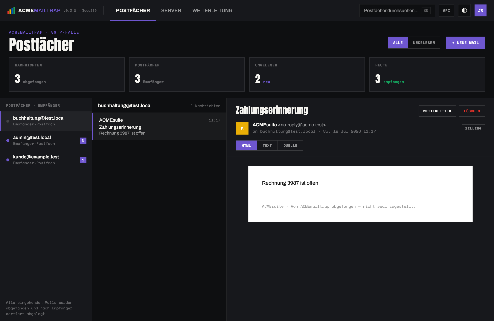

<h1 align="center">ACMEmailtrap</h1>

<p align="center"><em>A self-contained email trap for testing ACMEsuite mail flows — catch, read, search and forward test mail without touching real email.</em></p>

<p align="center">
  <a href="https://github.com/acmesoftware-de/acmemailtrap/actions/workflows/ci.yml"></a>
  <a href="https://github.com/acmesoftware-de/acmemailtrap/releases/latest"></a>
  
  <a href="LICENSE"></a>
</p>

<p align="center"></p>

Think MailHog/Mailpit, but built for the ACMEsuite ecosystem. It catches SMTP, stores
every message per recipient on disk, serves those mailboxes over IMAP and a web UI, lets
you compose test mail, searches everything full-text, and can optionally forward to a real
mail service through pluggable channels — all in **one Spring Boot process: no database,
no message broker, no CDN.** The on-disk store is plain files you can inspect, and the
whole thing ships as a single runnable jar.

## Features

- **Catch-all SMTP** (`:1025`) — accepts mail from any client for any recipient.
- **Per-recipient store** — each message is written as raw `.eml` under one folder per
  envelope recipient; the filesystem is the single source of truth.
- **IMAP** (`:1143`) — read the mailboxes back from any client (LOGIN, LIST, SELECT,
  FETCH incl. ENVELOPE/BODY, SEARCH, STORE \Seen).
- **Web UI** — a three-pane inbox (mailboxes / messages / reader) with HTML, text and
  raw-source views, attachments, per-module colours, light/dark, and a **⌘K command
  palette**.
- **Full-text search** — embedded Apache Lucene over subject, sender, body and mailbox;
  no external search service.
- **Compose** — send test mail straight into the trap (new recipients appear as new
  mailboxes) with a copy in *Sent*.
- **Pluggable forwarding** — relay caught mail to a real service via a `MailForwarder`
  plugin: **SMTP/TLS, Webhook, Microsoft 365 (Graph), Gmail, Postmark/SendGrid, Amazon
  SES**. Off by default.
- **Optional login** — protect a shared instance with a local password or GitHub/GitLab
  OAuth, gated by a local allowlist. Off by default (open on localhost).

## Quick start

Requirements: **JDK 25** and Maven. The React frontend is built automatically by Maven
(a pinned Node is downloaded, `vite build` runs, and the bundle is folded into the jar),
so one command produces one self-contained artifact:

```bash
mvn package
java -jar app/target/acmemailtrap.jar
```

| Surface | Default                 |
|---------|-------------------------|
| Web UI  | http://localhost:8090   |
| SMTP    | localhost:1025          |
| IMAP    | localhost:1143          |

Point ACMEsuite (or anything) at the SMTP port, or inject a message from the shell:

```bash
printf 'From: alice@acmesuite.test\r\nTo: bob@kunde.test\r\nSubject: Hello\r\n\r\nBody\r\n' \
  | curl -s --url 'smtp://localhost:1025' \
    --mail-from alice@acmesuite.test --mail-rcpt bob@kunde.test --upload-file -
```

It appears in the UI under the `bob@kunde.test` mailbox and is readable over IMAP (log in
as `bob@kunde.test` with any password; the mailbox is `INBOX`).

> Prebuilt jar: see the [latest release](https://github.com/acmesoftware-de/acmemailtrap/releases).
> Build the backend only (skip the npm build) with `mvn package -Dskip.frontend=true`.

## Architecture

The **filesystem is the single source of truth.** Layout under `data-dir`:

```
data/
  bob@kunde.test/
    .address                       canonical recipient address
    1720000000000-ab12cd34.eml     raw RFC 822 message  (authoritative)
    1720000000000-ab12cd34.json    derived index (subject, from, seen, ...)
```

The `.eml` is authoritative; the `.json` is a regenerable cache. SMTP and IMAP are small
hand-rolled socket servers on purpose: it keeps the dependency surface to Spring Boot plus
Jakarta Mail (used only for MIME parsing, composing and outbound relay) and avoids the
javax/jakarta split of older libraries. The Lucene search index is in-memory and rebuilt
from the store on startup — no index files, no external service.

### Repository layout (Maven multi-module → one jar)

- **`plugin-api/`** — the stable plugin SPI (`MailForwarder`, `ConfigField`, ...). Pure
  Java, no framework dependencies.
- **`plugins/`** — the built-in forwarder plugins; depend only on the plugin API and are
  discovered as Spring beans.
- **`app/`** — the runnable application (SMTP/IMAP/store/web/search + the React UI under
  `app/frontend/`). Depends on the two modules and repackages everything into one jar.

`mvn package` at the root builds all three into `app/target/acmemailtrap.jar`. Adding a
forwarder is a new bean in `plugins/` — no `app` changes, no UI changes (the Weiterleitung
view renders any forwarder from its config schema).

## Forwarding (optional)

Forwarding is off by default. Enable it and pick a channel at runtime in the
**Weiterleitung** view (or via `PUT /api/forward`); each mailbox can be routed
independently. Built-in channels:

| Channel | Notes |
|---------|-------|
| SMTP (STARTTLS/SSL) | universal; also covers SES/Postmark/Mailgun SMTP and self-hosted MTAs |
| Webhook / HTTP relay | POST raw MIME or JSON to a URL, optional HMAC signature |
| Microsoft 365 (Graph) | `sendMail` with raw MIME, OAuth2 client-credentials |
| Google Workspace (Gmail) | `messages.send`, OAuth2 refresh token |
| Postmark / SendGrid | transactional HTTP APIs (message recomposed from MIME) |
| Amazon SES | SES v2 raw MIME, AWS Signature V4 |

The initial SMTP relay can be seeded from configuration:

```yaml
acmemailtrap:
  forward:
    enabled: false
    host: smtp.example.com
    port: 587
    username: ""
    password: ""
    starttls: true
```

## Configuration

All settings live under `acmemailtrap.*` (see `app/src/main/resources/application.yml`)
and can be overridden with environment variables or CLI args:

```yaml
acmemailtrap:
  data-dir: ./data
  smtp: { enabled: true, bind: 0.0.0.0, port: 1025, max-message-size: 26214400 }
  imap: { enabled: true, bind: 0.0.0.0, port: 1143 }
```

## Authentication (optional)

Open by default (zero-friction on localhost). To protect a shared instance, enable login
under `acmemailtrap.auth.*`. **SMTP/IMAP are never affected; only the web UI/API are
gated.** Authorization is a local allowlist — an OAuth provider with an empty allowlist
admits nobody (fail closed), and the role a user gets is assigned locally, never derived
from the provider.

```yaml
acmemailtrap:
  auth:
    enabled: true
    local:  { enabled: true, username: admin, password: "change-me" }
    github:                         # OAuth App; callback .../login/oauth2/code/github
      enabled: true
      client-id: "..."
      allowed-orgs:  [acmesoftware-de]
      allowed-users: [fschupp]
    gitlab:                         # self-hosted friendly; .../login/oauth2/code/gitlab
      enabled: false
      base-url: "https://gitlab.example.com"
      client-id: "..."
      allowed-groups: [platform/team]
```

Supply secrets via environment variables
(`ACMEMAILTRAP_AUTH_GITHUB_CLIENT_SECRET=...`) rather than committed config.

## Frontend development

The UI (`app/frontend/`) is React + TypeScript + Vite, Zustand for state, self-hosted
fonts via `@fontsource`. For a fast edit loop, run the backend and the Vite dev server
side by side — the dev server proxies `/api` to the backend on :8090:

```bash
java -jar app/target/acmemailtrap.jar          # or: mvn -pl app -am spring-boot:run
cd app/frontend && npm install && npm run dev   # http://localhost:5173
```

## Docker

```bash
docker run -d --name acmemailtrap \
  --read-only --tmpfs /tmp -v acmemailtrap-data:/data \
  --cap-drop ALL --security-opt no-new-privileges \
  -p 127.0.0.1:8090:8090 \
  acmesoftwaredotde/acmemailtrap:latest
# Web UI on http://localhost:8090
```

The image runs as a **non-root** user with a **read-only root filesystem**; the maildir
lives in the `/data` volume. SMTP (`:1025`) and IMAP (`:1143`) are unauthenticated by
design — publish them only on a trusted/loopback interface (e.g. add
`-p 127.0.0.1:1025:1025`), never to the public internet. Build it yourself with
`docker build -t acmemailtrap .`.

## Deploying securely

SMTP and IMAP are unauthenticated by design, so they must never be exposed to the public
internet. To run a shared instance safely — the app on loopback, a default-deny firewall,
nginx terminating TLS, and the UI behind login — follow the step-by-step guide:
**[docs/secure-deployment.md](docs/secure-deployment.md)** (systemd + ufw + nginx + TLS).

## Limitations

This is a testing tool, not a production mail server. It requires no SMTP/IMAP
authentication, accepts every recipient, and its IMAP server implements a pragmatic
read-mostly subset (UID equals sequence number within a snapshot, constant UIDVALIDITY,
single-part BODYSTRUCTURE). Do not expose it to untrusted networks.

## License

Apache-2.0. See [LICENSE](LICENSE).
